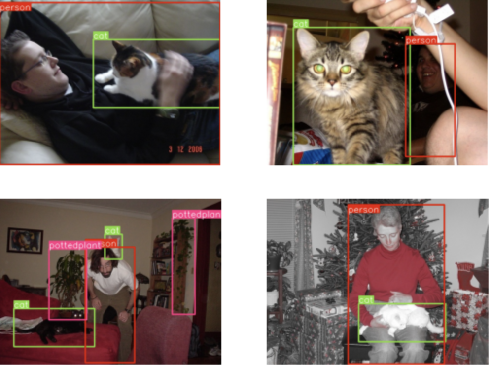
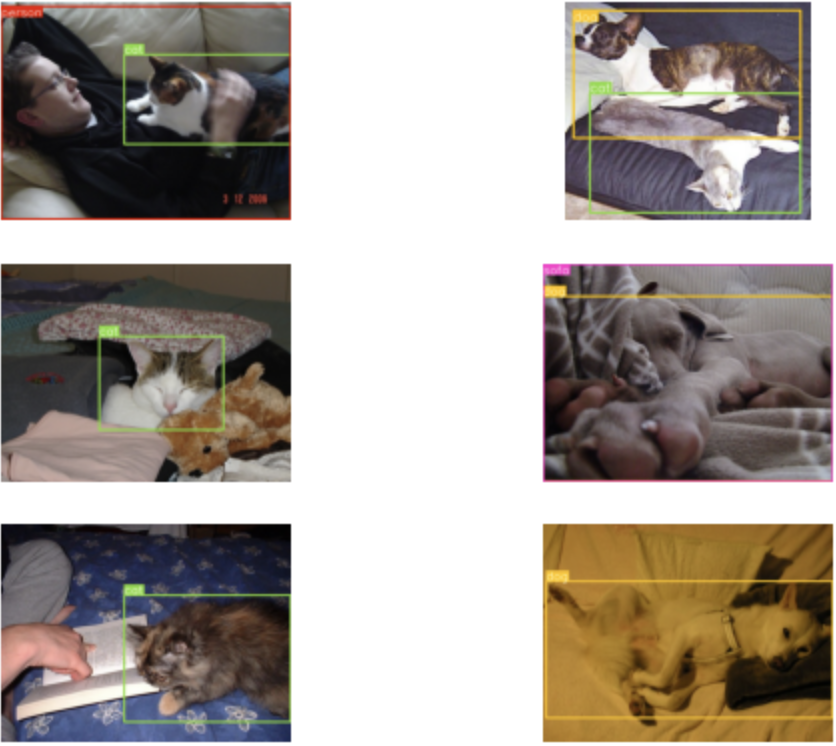

# YOLOExplorer

Explore, manipulate and iterate on Computer Vision datasets with precision using simple APIs. 
Supports SQL filters, vector similarity search, native interface with Pandas and more.

### Installation (TODO: Relase on pypi)
```
pip install yoloexplorer
```
Building from source
```
pip install -e . 
```

## Quickstart
YOLOExplorer can be used to rapidly generate new versions of CV datasets trainable on [Ultralytics YOLO, SAM, FAST-SAM, RT-DETR](https://github.com/ultralytics/ultralytics) and more models.

Start exploring your Datasets in 2 simple steps
* Select a supported dataset or bring your own. Supports all  Ultralytics YOLO datasets currently
```python
from yoloexplorer import Explorer

coco_exp = Explorer("coco128.yaml")
```
* Build the LanceDB table to allow querying
```python
coco_exp.build_embeddings()
```
<details open>
<summary> <b> Querying Basics </b> </summary>

You can get the schema of you dataset once the table is built
```
schema = coco_exp.table.schema
```
You can use this schema to run queries

<b>SQL query</b><br/>
Let's try this query and print 4 result - Select instances that contain one or more 'person' and 'cat'
```python
df = coco_exp.sql("SELECT * from 'table' WHERE labels like '%person%' and labels LIKE '%cat%'")
coco_exp.plot_imgs(ids=df["id"][0:4].to_list())
```
Result

The above is equivlant to plotting directly with a query:
```python
voc_exp.plot_imgs(query=query, n=4)
```

<b>Querying by similarity</b><br/>
Now lets say your model confuses between cetain classes( cat & dog for example) so you want to look find images similar to the ones above to investigate.

The id of the first image in this case was 117
```python
imgs, ids = coco_exp.get_similar_imgs(117, n=6) # accepts ids/idx, Path, or img blob
voc_exp.plot_imgs(ids)
```

The above is equivlant to directly calling `plot_similar_imgs`
```python
voc_exp.plot_similar_imgs(117, n=6)
```
NOTE: You can also pass any image file for similarity search, even the ones that are not in the dataset


<b>Similarity Search with SQL Filter (Coming Soon)</b></br>
Soon you'll be able to have a finer control over the queries by pre-filtering your table
```
coco_exp.get_similar_imgs(..., query="WHERE labels LIKE '%motorbike%'")
coco_exp.plot_similar_imgs(query="WHERE labels LIKE '%motorbike%'")
```
</details>

<details>
<summary> <b>Plotting</b></summary>
Here are the supported visualization methods for different stages of analysis.
* `plot_imgs(ids, query, n=10)` - To plot the given `ids` or the result of the SQL query. One of the 2 must be provided. 
* `plot_similar_imgs(img/idx, n=10)` - To plot `n` top similar images to the given img. Accepts img idx from the dataset, Path to imgs or encoded/binary img
* `plot_similarity_index(top_k=0.01, sim_thres=0.90, reduce=False, sorted=False)` - To plot the similarity index of the dataset. This gives measure of how similar an img is when compared to all the imgs of the dataset. (Working with similarity index is covered in detail in the Advanced section)

</details>

<details>
<summary> <b>Add, remove, persist new Datasets and start training!</b></summary>
Once you've found the right images that you'd like to add or remove, you can simply add/remove them from your dataset and generate the updated version.

<b>Removing data</b><br/>
You can simply remove images by passing a list of `ids` from the table.
```
coco_exp.remove_imgs([100,120,300..n]) # Removes images at the given ids.
```

<b>Adding data</b><br/>
For adding data from another dataset, you need an explorer object of that dataset with embeddings built. You can then pass that object along with the ids of the imgs that you'd like to add from that dataset.
```
coco_exp.add_imgs(exp, idxs) # 
```
Note: You can use SQL querying and/or similarity searches to get the desired ids from the datasets.

<b>Persisting the Table: Create new dataset and start training</b><br/>
After making the desired changes, you can persist the table to create the new dataset. 
```
coco_exp.persist()
```
This creates a new dataset and outputs the training command that you can simply paste in your terminal to train a new model!

<b>Resetting the Table</b><br/>
You can reset the table to its original or last persisted state (whichever is latest)
```
coco_exp.reset()
```
</details>

<details>
<summary>(Advanced querying)Getting insights from Similarity index</summary>

</details>
TODO

TODOs before release
- [ ]  Register Pypi
- [x] Add more tests
- [x] Write basic README
- [x] Write intro notebooks
- [ ] Warn/throw when mixing OOD data
- [ ] Move hacky code outside the main API file

